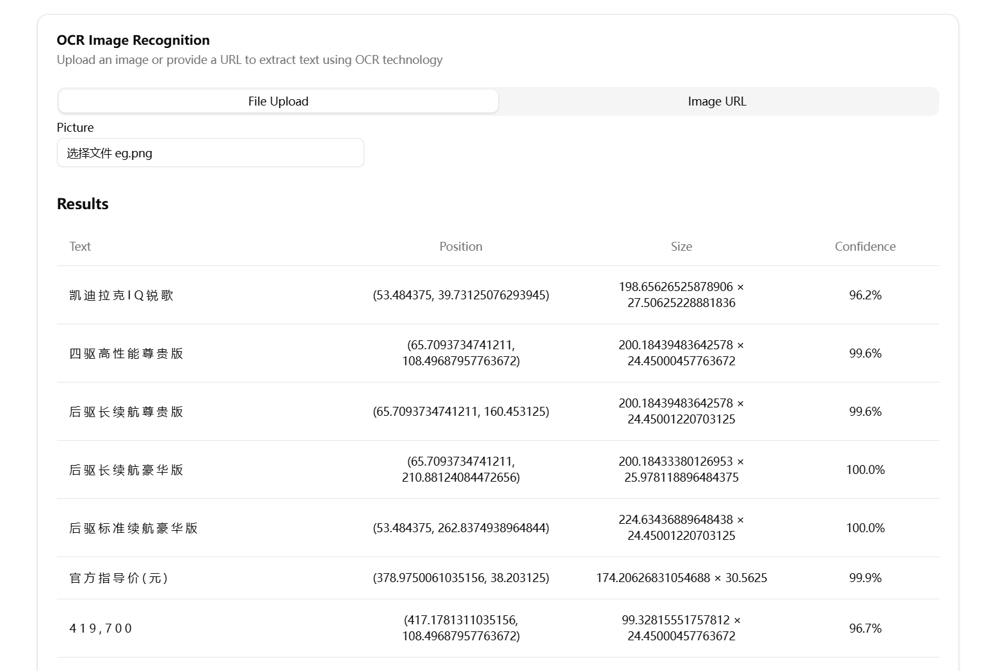

# Image OCR Demo

一个基于Next.js开发的图片OCR工具，可以快速从各种图片中提取文字内容。本项目采用现代化的技术栈，提供流畅的用户体验和高效的文字识别功能。

## 功能特点

- 🖼️ 支持多种图片格式的文字识别
- 🚀 基于Next.js 15.2构建，性能优异
- 💅 使用Tailwind CSS和shadcn/ui构建的现代化UI
- 📱 响应式设计，支持移动端和桌面端
- 🔍 支持图片预览和OCR结果展示
- 🎯 精准的文字识别结果

## 效果展示




主界面支持拖拽上传或点击选择文件，支持PNG、JPG等常见图片格式。上传后会自动进行OCR识别并展示结果，适用于各类图片的文字提取需求。界面简洁直观，操作便捷。

## 本地开发

### 环境要求

- Node.js 18.0.0 或更高版本
- npm 9.0.0 或更高版本

### 环境变量配置

在项目根目录创建 `.env` 文件，添加以下配置：

```bash
# API服务器地址，默认为http://localhost:5000
API_BASE_URL=http://localhost:5000
```

### 安装步骤

1. 克隆项目到本地：

```bash
git clone https://github.com/your-username/wx-ocr-demo.git
cd wx-ocr-demo
```

2. 安装依赖：

```bash
npm install
```

3. 启动开发服务器：

```bash
npm run dev
```

4. 在浏览器中打开 [http://localhost:3000](http://localhost:3000) 查看效果

## 构建部署

1. 创建生产环境配置文件 `.env.production`：

```bash
API_BASE_URL=https://your-api-server.com
```

2. 执行以下命令构建生产环境版本：

```bash
npm run build
```

3. 启动生产环境服务器：

```bash
npm run start
```

## 技术栈

- [Next.js](https://nextjs.org/) - React框架
- [Tailwind CSS](https://tailwindcss.com/) - CSS框架
- [shadcn/ui](https://ui.shadcn.com/) - UI组件库
- [Radix UI](https://www.radix-ui.com/) - 无障碍UI原语
- [next-intl](https://next-intl-docs.vercel.app/) - 国际化支持

## 技术原理

本项目的OCR识别功能基于[swigger/wechat-ocr](https://github.com/swigger/wechat-ocr)项目实现。该项目提供了高效、准确的OCR文字识别能力，能够快速从图片中提取文字内容。通过集成该项目的OCR能力，我们实现了一个现代化的Web界面，让用户可以方便地使用这一强大的文字识别功能。

## 项目结构

```
├── public/          # 静态资源
├── src/
│   ├── app/         # 页面组件
│   ├── components/  # 通用组件
│   ├── config/      # 配置文件
│   └── lib/         # 工具函数
└── ...配置文件
```

## 贡献指南

1. Fork 本仓库
2. 创建功能分支 (`git checkout -b feature/AmazingFeature`)
3. 提交更改 (`git commit -m 'Add some AmazingFeature'`)
4. 推送到分支 (`git push origin feature/AmazingFeature`)
5. 提交 Pull Request

## 许可证

[MIT](LICENSE)
